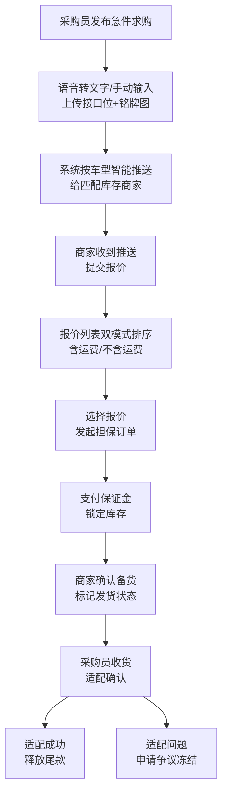

## 1. 产品概述

配易通 - 面向汽配同行的专业找货协作平台，服务于配件商、修理厂采购员、拆车件黄页群主等天天找件的从业者。通过急找频道、现货频道、信誉档案、担保订单、圈内通讯五大模块，解决串货难、跨城找货效率低、口头承诺无保障等痛点，打造高效可信的汽配B2B协作生态。

## 2. 核心功能

### 2.1 用户角色

| 角色 | 注册方式 | 核心权限 |
|------|----------|----------|
| 配件商 | 营业执照认证 | 发布现货、报价、承接担保订单 |
| 修理厂采购员 | 企业认证 | 发布求购、发起担保订单、收货确认 |
| 黄页群主 | 邀请码+认证 | 创建群组、管理群成员、聚合求购信息 |
| 拆车件商家 | 营业执照认证 | 发布拆车件、参与接龙补货 |

### 2.2 功能模块

1. **急找频道**：30分钟急件求购发布、语音转文字快速报件、按车型智能推送、接口位/铭牌图上传、接龙补货
2. **现货频道**：车型/配件分类筛选、件源城市与当天发车标识、报价含运/不含运双排序、库存商家展示
3. **信誉档案**：放鸽子率、错发率、成交笔数、好评率、常合作商快捷名单
4. **担保订单**：锁货保证金、多人接龙补货、适配确认、尾款释放、争议冻结
5. **圈内通讯**：1对1私聊、行业群聊、黄页群主管理、报价消息推送

### 2.3 页面详情

| 页面名称 | 模块名称 | 功能描述 |
|----------|----------|----------|
| 急找频道 | 急件列表 | 实时滚动展示30分钟内急件，倒计时动态显示，按紧急度/车型筛选 |
| 急找频道 | 发布急件 | 语音报件/手动输入，上传接口位和铭牌图，选择车型平台，设置有效时间 |
| 急找频道 | 接龙补货 | 显示同一需求的接龙列表，支持多人分批次供货，标记意向/已确认状态 |
| 现货频道 | 现货列表 | 卡片式展示件源，显示城市距离、当天发车标签、库存数量、价格范围 |
| 现货频道 | 报价排序 | 切换含运费/不含运费两种排序视图，标注运费金额差异 |
| 现货频道 | 筛选条件 | 车型品牌/年款/配件分类/城市范围/拆车件或全新件多维度筛选 |
| 信誉档案 | 个人档案 | 放鸽子率饼图、错发率趋势、累计成交、好评星级、认证徽章 |
| 信誉档案 | 快捷名单 | 常合作商分组管理、一键联系、快速发起担保订单 |
| 信誉档案 | 同行评价 | 查看历史交易评价，支持文字+标签评价，争议处理记录展示 |
| 担保订单 | 订单列表 | 待支付/待发货/待确认/已完成/争议中 五状态Tab切换 |
| 担保订单 | 锁货操作 | 支付保证金锁定库存，超时自动释放，卖方确认备货进度 |
| 担保订单 | 适配确认 | 收货后上传安装对比图，标记适配/错发/待核实，触发尾款流程 |
| 担保订单 | 争议处理 | 申请冻结尾款，上传举证材料，平台仲裁流程，进度追踪 |
| 圈内通讯 | 消息列表 | 会话列表，未读数标记，报价/订单系统消息分类提醒 |
| 圈内通讯 | 聊天界面 | 文字/语音/图片消息，快速报价模板，发送配件卡片 |
| 圈内通讯 | 群组管理 | 黄页群主专属：成员管理、批量发布求购、群内信誉分排名 |

## 3. 核心流程

### 3.1 急件找货流程

采购员发布30分钟急件 → 系统按车型平台匹配库存商家 → 商家收到推送后报价 → 采购员查看报价（含运/不含运排序）→ 选择合适报价发起担保订单 → 支付保证金锁货 → 商家发货 → 收货适配确认 → 尾款释放

### 3.2 接龙补货流程

求购方发布大量需求 → 多个商家接龙表示可供应部分数量 → 求购方确认各商家供应量 → 分别生成担保子订单 → 各商家独立发货 → 分别确认收货 → 汇总结算

## 4. 用户界面设计

### 4.1 设计风格

- **主色调**：深邃钢铁蓝 (#0F2748) - 体现汽配行业的专业与信赖感
- **强调色**：警示橙 (#FF6B35) - 用于急找、倒计时、紧急提醒
- **辅助色**：成交绿 (#22C55E) 用于成功/确认，警示红 (#EF4444) 用于争议/告警
- **背景色**：极浅灰蓝 (#F5F7FA) 主背景，纯白卡片配1px浅蓝边框
- **按钮风格**：圆角12px，主按钮蓝橙渐变，次按钮白底蓝边
- **字体**：标题使用「思源黑体 Heavy」，正文「思源黑体 Regular」，数字使用等宽字体增强可读性
- **布局风格**：卡片式信息流，移动端优先，底部Tab导航+顶部筛选栏
- **图标风格**：线性双色图标，急找模块使用填充式橙图标增强视觉优先级

### 4.2 页面设计概览

| 页面名称 | 模块名称 | UI元素 |
|----------|----------|--------|
| 急找频道 | 急件列表 | 橙红紧急标签、30分钟圆形进度环、车型芯片、城市距离胶囊、闪烁「新发布」动效 |
| 急找频道 | 发布急件 | 大号麦克风悬浮按钮、语音波形动效、图片上传网格、倒计时选择器 |
| 现货频道 | 现货卡片 | 城市定位图标+距离文字、绿色「当天发」徽章、价格拆分显示（货值/运费） |
| 信誉档案 | 数据展示 | 放鸽子率环形图（红/绿分段）、错发率折线图、星级评分组件、认证标签墙 |
| 担保订单 | 状态追踪 | 垂直时间轴进度条、各状态彩色节点、保证金金额锁定动效、争议警示横幅 |
| 圈内通讯 | 聊天界面 | 消息气泡卡片化、配件卡片富消息、报价快捷回复模板、群信誉角标 |

### 4.3 响应式设计

- 采用**移动优先**设计策略，核心体验针对375px~428px宽度优化
- 底部固定5个Tab导航，44px高度，配合安全区域适配
- 页面内容区支持下拉刷新、上拉加载更多
- 横向滑动筛选栏在小屏设备自动变为可滚动物流
- 所有可点击元素≥44x44px触控热区
- 支持横屏模式下双栏布局（列表+详情）

### 4.4 动效与交互

- 急件发布成功：橙色冲击波从按钮向外扩散 + 顶部Toast推送成功提示
- 倒计时进度环：每10秒颜色渐变（绿→黄→红），剩余5分钟时脉冲动画
- 报价列表排序切换：卡片平滑重排（transform过渡），含运模式运费行淡入
- 担保订单支付：保证金数字滚动累加 + 锁头图标锁定动画
- 接龙补货：新增接龙者从右侧滑入，头像叠加堆叠效果
