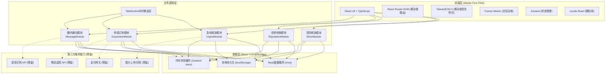
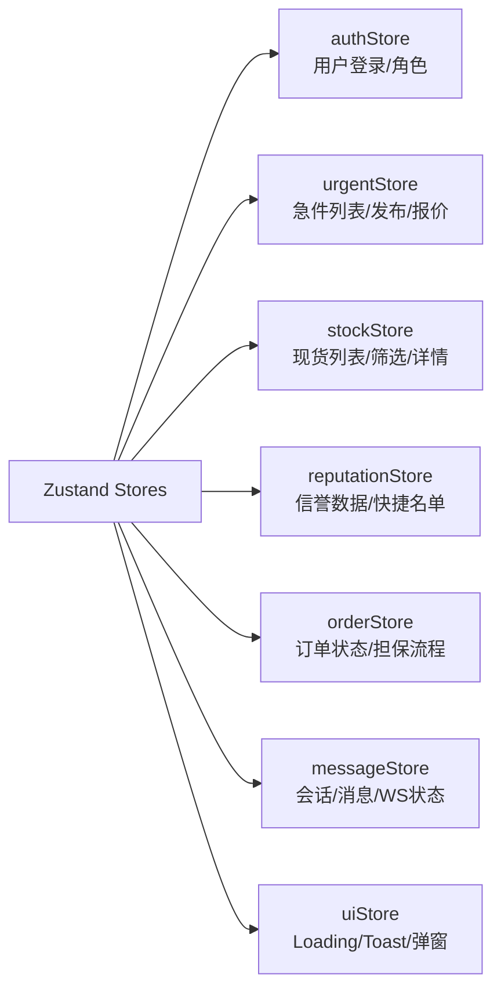

## 1. 架构设计



## 2. 技术描述

- **前端框架**: React@18.2.0 + TypeScript@5.3.0
- **初始化工具**: Vite@5.0.0 (vite-react-ts模板)
- **样式方案**: TailwindCSS@3.4.0 + PostCSS + Autoprefixer
- **路由管理**: React Router DOM@6.21.0 (Hash路由适配移动端)
- **状态管理**: Zustand@4.4.0 (轻量级store，支持持久化中间件)
- **动效库**: Framer Motion@10.16.0 (页面转场、列表动画、微交互)
- **图标库**: Lucide React@0.300.0 (线性图标，支持双色配置)
- **图表可视化**: Recharts@2.10.0 (放鸽子率饼图、错发率折线图)
- **Mock服务**: Mock Service Worker (msw@2.0.0) - Service Worker层拦截请求
- **后端**: 无后端，全部使用Mock数据模拟真实业务流程
- **数据存储**: LocalStorage持久化用户偏好、收藏商家、草稿急件

## 3. 路由定义

| 路由路径 | 页面名称 | 模块归属 | 说明 |
|----------|----------|----------|------|
| / | 首页重定向 | - | 自动跳转到急找频道 |
| /urgent | 急找频道首页 | 急找频道 | 急件列表、筛选栏、发布按钮 |
| /urgent/publish | 发布急件 | 急找频道 | 语音输入、车型选择、图片上传表单 |
| /urgent/:id | 急件详情 | 急找频道 | 急件信息、报价列表、接龙面板 |
| /stock | 现货频道 | 现货频道 | 现货列表、多维筛选、排序切换 |
| /stock/:id | 现货详情 | 现货频道 | 件源信息、商家信誉、发起担保 |
| /reputation | 信誉档案首页 | 信誉档案 | 个人数据看板、快捷名单入口 |
| /reputation/list | 快捷名单 | 信誉档案 | 常合作商分组列表、一键操作 |
| /reputation/:userId | 同行档案 | 信誉档案 | 同行数据、历史评价、交易记录 |
| /order | 担保订单列表 | 担保订单 | 五状态Tab切换、搜索筛选 |
| /order/:id | 订单详情 | 担保订单 | 状态时间轴、锁货信息、适配确认 |
| /order/:id/dispute | 争议处理 | 担保订单 | 举证上传、仲裁进度、解冻操作 |
| /message | 消息列表 | 圈内通讯 | 会话列表、系统分类、未读统计 |
| /message/:chatId | 聊天界面 | 圈内通讯 | 消息流、报价模板、配件卡片 |

## 4. 核心数据模型 (TypeScript类型定义)

```typescript
// ============ 用户与信誉相关 ============
interface User {
  id: string;
  name: string;
  avatar: string;
  role: 'supplier' | 'buyer' | 'groupOwner' | 'dismantler';
  company: string;
  city: string;
  verified: boolean;
  certificationBadges: string[];
  reputation: Reputation;
  createdAt: string;
}

interface Reputation {
  totalDeals: number;
  pigeonRate: number;          // 放鸽子率 0-1
  wrongShipRate: number;       // 错发率 0-1
  positiveRate: number;        // 好评率 0-1
  starRating: number;          // 星级 1-5
  quickTags: string[];         // 信誉标签：发货快/包装好/价格公道
}

// ============ 急找频道相关 ============
interface UrgentPost {
  id: string;
  publisherId: string;
  publisher: User;
  carPlatform: CarPlatform;
  partName: string;
  partNumber?: string;
  quantity: number;
  description: string;
  images: string[];             // 接口位/铭牌图
  createdAt: string;
  expiresAt: string;            // 30分钟有效期
  status: 'active' | 'quoted' | 'locked' | 'completed' | 'expired';
  relayList: RelayItem[];       // 接龙补货列表
  quotes: Quote[];
}

interface Quote {
  id: string;
  urgentPostId: string;
  supplierId: string;
  supplier: User;
  price: number;                // 不含运费单价
  shippingFee: number;          // 运费
  totalPrice: number;           // 含运费总价
  canShipToday: boolean;
  sourceCity: string;
  distanceKm: number;
  conditionType: 'new' | 'used' | 'refurbished';
  warrantyDays: number;
  remark: string;
  createdAt: string;
}

interface RelayItem {
  id: string;
  urgentPostId: string;
  supplierId: string;
  supplier: User;
  quantity: number;
  unitPrice: number;
  status: 'intention' | 'confirmed' | 'shipped' | 'received';
  remark: string;
  createdAt: string;
}

// ============ 现货频道相关 ============
interface StockItem {
  id: string;
  supplierId: string;
  supplier: User;
  carPlatform: CarPlatform;
  partName: string;
  partNumber: string;
  conditionType: 'new' | 'used' | 'refurbished';
  stockQty: number;
  unitPrice: number;
  shippingFee: number;          // 默认运费
  sourceCity: string;
  canShipToday: boolean;
  images: string[];
  tags: string[];
  createdAt: string;
}

interface CarPlatform {
  brand: string;
  series: string;
  year: string;
  model: string;
  platformCode?: string;
}

// ============ 担保订单相关 ============
interface GuaranteeOrder {
  id: string;
  orderNo: string;
  buyerId: string;
  buyer: User;
  supplierId: string;
  supplier: User;
  sourceType: 'urgent' | 'stock';
  sourceId: string;
  partInfo: PartSnapshot;
  totalAmount: number;
  depositAmount: number;        // 保证金(锁货金)
  finalAmount: number;          // 尾款
  shippingFee: number;
  status: OrderStatus;
  timeline: OrderTimelineItem[];
  relayOrderIds?: string[];     // 接龙子订单ID
  isRelayParent: boolean;
  adaptConfirm?: AdaptConfirm;
  dispute?: DisputeRecord;
  createdAt: string;
}

type OrderStatus = 
  | 'pending_payment'     // 待支付保证金
  | 'deposited'           // 已支付保证金(锁货中)
  | 'preparing'           // 备货中
  | 'shipped'             // 已发货
  | 'delivered'           // 已送达待确认
  | 'adapt_confirmed'     // 适配确认通过
  | 'completed'           // 已完成(尾款已释放)
  | 'disputing'           // 争议处理中
  | 'cancelled';          // 已取消

interface OrderTimelineItem {
  status: OrderStatus;
  timestamp: string;
  operatorId: string;
  remark: string;
  images?: string[];
}

interface AdaptConfirm {
  confirmed: boolean;
  result: 'fit' | 'wrong' | 'partial' | 'pending';
  images: string[];
  remark: string;
  confirmedAt: string;
}

interface DisputeRecord {
  id: string;
  orderId: string;
  applicantId: string;
  reason: string;
  evidenceImages: string[];
  frozenAmount: number;
  status: 'pending' | 'mediating' | 'resolved_buyer' | 'resolved_supplier' | 'resolved_split';
  arbitratorRemark?: string;
  resolutionAmount?: { buyer: number; supplier: number };
  createdAt: string;
  resolvedAt?: string;
}

// ============ 圈内通讯相关 ============
interface ChatSession {
  id: string;
  type: 'private' | 'group';
  participants: string[];
  lastMessage: ChatMessage;
  unreadCount: number;
  groupInfo?: GroupInfo;
  updatedAt: string;
}

interface GroupInfo {
  name: string;
  avatar: string;
  ownerId: string;
  memberCount: number;
  isYellowPage: boolean;      // 是否黄页群主
  memberReputationRank?: GroupMemberRank[];
}

interface GroupMemberRank {
  userId: string;
  reputationScore: number;
  dealCount: number;
}

interface ChatMessage {
  id: string;
  sessionId: string;
  senderId: string;
  type: 'text' | 'image' | 'voice' | 'quote' | 'part_card' | 'order_card' | 'system';
  content: string;
  payload?: QuotePayload | PartCardPayload | OrderCardPayload;
  timestamp: string;
  readBy: string[];
}

interface QuotePayload {
  urgentPostId: string;
  price: number;
  shippingFee: number;
  canShipToday: boolean;
}

interface PartCardPayload {
  stockId: string;
  partName: string;
  price: number;
  supplierName: string;
}

interface OrderCardPayload {
  orderId: string;
  orderNo: string;
  status: OrderStatus;
  amount: number;
}
```

## 5. Store分层设计



**Store持久化策略**:
- authStore: 全量持久化到localStorage
- reputationStore: 快捷名单持久化
- messageStore: 最近100条消息持久化
- urgentStore/stockStore/orderStore: 仅持久化筛选偏好，列表数据每次刷新重新拉取

## 6. 项目目录结构

```
src/
├── assets/                 # 静态资源
│   ├── images/             # 占位图、车型示例图
│   └── icons/              # 自定义SVG图标
├── components/             # 通用UI组件
│   ├── layout/             # 布局：BottomNav、TopBar、SafeArea
│   ├── ui/                 # 基础组件：Button、Card、Badge、Chip
│   └── business/           # 业务组件：UrgentCard、QuoteList、Timeline
├── pages/                  # 页面级组件 (对应路由)
│   ├── urgent/             # 急找频道3个页面
│   ├── stock/              # 现货频道2个页面
│   ├── reputation/         # 信誉档案3个页面
│   ├── order/              # 担保订单3个页面
│   └── message/            # 圈内通讯2个页面
├── stores/                 # Zustand状态管理
│   ├── authStore.ts
│   ├── urgentStore.ts
│   ├── stockStore.ts
│   ├── reputationStore.ts
│   ├── orderStore.ts
│   ├── messageStore.ts
│   └── uiStore.ts
├── types/                  # TypeScript类型定义
│   ├── index.ts            # 汇总导出
│   ├── user.ts
│   ├── urgent.ts
│   ├── stock.ts
│   ├── order.ts
│   └── message.ts
├── mock/                   # Mock数据与模拟接口
│   ├── handlers/           # MSW请求处理器
│   ├── data/               # 初始模拟数据
│   └── browser.ts          # MSW启动文件
├── utils/                  # 工具函数
│   ├── format.ts           # 金额、时间、距离格式化
│   ├── countdown.ts        # 倒计时计算
│   ├── sort.ts             # 报价排序算法
│   └── vehicle.ts          # 车型匹配逻辑
├── hooks/                  # 自定义Hooks
│   ├── useCountdown.ts     # 倒计时Hook
│   ├── useVoiceInput.ts    # 语音输入模拟Hook
│   ├── usePullRefresh.ts   # 下拉刷新Hook
│   └── useWebSocket.ts     # WS模拟Hook
├── styles/                 # 全局样式
│   └── globals.css
├── router/                 # 路由配置
│   └── index.tsx
├── App.tsx
└── main.tsx
```
